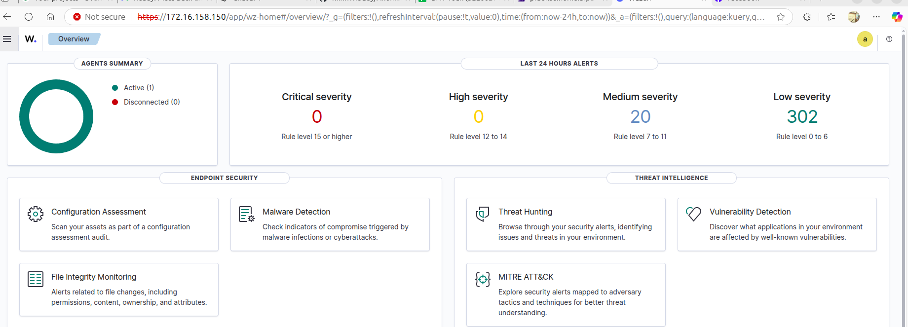

# Wazuh-ML: Hệ thống NIDS Lai 3 Lớp (Suricata + VAE + XGBoost)

> **Dự án chính nằm tại thư mục:** [`wazuh-ml/`](wazuh-ml/)

Hệ thống phát hiện xâm nhập mạng (NIDS) lai ghép, kết hợp signature-based (Suricata), anomaly detection (VAE), và supervised learning (XGBoost) để bảo vệ hệ thống Wazuh Lab.

---

## 1. Kiến trúc Hệ thống (3 Lớp)

Hệ thống sử dụng cơ chế **"Phễu Lọc"** để tối ưu hóa hiệu suất và độ chính xác:

1.  **Lớp 1 (Suricata):** Phát hiện các tấn công đã biết dựa trên chữ ký (Signature-based). Nhanh, độ chính xác cao với các mối đe dọa phổ biến.
2.  **Lớp 2 (XGBoost):** Phân loại các luồng mạng (network flows) độc hại đã biết mà Suricata có thể bỏ qua.
3.  **Lớp 3 (VAE - Variational Autoencoder):** Phát hiện bất thường (Anomaly Detection) cho các tấn công chưa biết (Zero-day) hoặc hành vi lạ, sử dụng cơ chế tái tạo lỗi (reconstruction error).

---

## 2. Môi trường Lab

### **2.1. Hạ tầng phần cứng/ảo hóa:**

#### **A. pfSense Firewall/Router**

*   **Version:** pfSense 2.7.2-RELEASE
*   **Hardware:** VMware VM (2 vCPU, AMD Ryzen 5 5500U)
*   **Network:**
    *   WAN (em0): `192.168.180.129/24`
    *   LAN (em1): `172.16.158.100/24`
*   **Vai trò:** Gateway, Firewall, Suricata IDS, Packet Capture (tcpdump).

#### **B. Wazuh All-in-One Server**



*   **IP:** `172.16.158.150`
*   **OS:** Ubuntu/Debian-based
*   **Components:** Wazuh Manager, Indexer, Dashboard.
*   **Vai trò:** SIEM trung tâm, nhận cảnh báo từ NIDS, hiển thị dashboard.

#### **C. Machine Learning Station (NIDS Core)**
*   **OS:** Ubuntu Desktop 22.04 LTS
*   **Môi trường:** Python 3.12 (`mlenv`), VS Code, Jupyter.
*   **Vị trí mã nguồn:** `~/Desktop/AnomalyDetection/wazuh-ml/`
*   **Vai trò:** Chạy pipeline thu thập (SSH tcpdump), trích xuất đặc trưng (CICFlowMeter), và dự đoán (XGBoost/VAE).

### **2.2. Sơ đồ mạng**

```
Internet
   |
   | (WAN: 192.168.180.129/24)
   |
[pfSense Firewall]
   |
   | (LAN: 172.16.158.100/24)
   |
   +--- 172.16.158.1    (Gateway)
   +--- 172.16.158.150  (Wazuh Server)
   +--- 172.16.158.x    (Agents + ML Machine)
```

---

## 3. Bắt đầu (Quick Start)

Mọi mã nguồn và hướng dẫn chạy hệ thống đều nằm trong thư mục `wazuh-ml`.

### **Cài đặt & Chạy**

```bash
cd wazuh-ml

# 1. Cài đặt dependencies
pip install -r requirements.txt

# 2. Cấu hình (Tạo file .env)
bash config/setup_actions.sh

# 3. Chạy hệ thống giám sát (Pipeline đầy đủ)
python scripts/detection_pipeline.py --continuous --action alert
```

Xem chi tiết tại **[wazuh-ml/README.md](wazuh-ml/README.md)**.

---

## 4. Quản lý Dữ liệu

Repository này đã được cấu hình `.gitignore` chặt chẽ để **loại bỏ** các file lớn:
*   Dataset CSV (`data/cicids/`, `data/raw/`)
*   PCAP capture (`data/captured/`)
*   Model binaries (`*.pkl`, `*.keras`)

**Lưu ý:** Khi clone project này, bạn sẽ cần tải lại dataset CIC-IDS-2017 hoặc sử dụng các script thu thập dữ liệu (`scripts/capture_labeled_traffic.py`) để tạo dữ liệu mới.

---