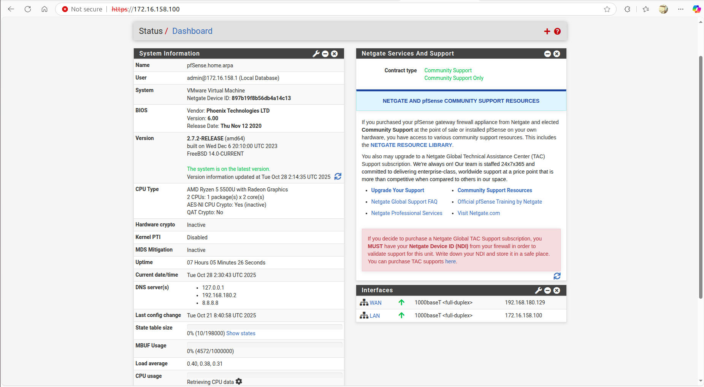
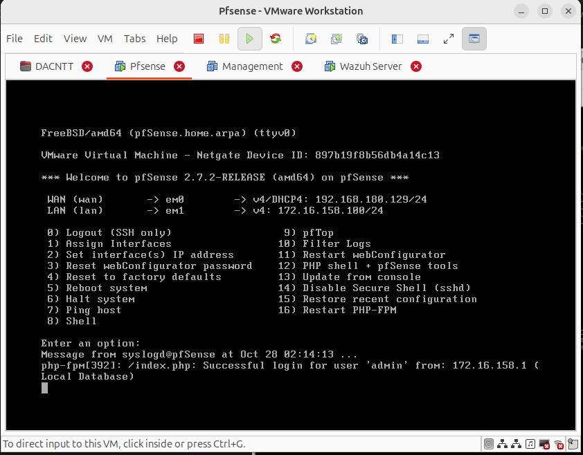

# Xây dựng hệ thống phát hiện bất thường (Anomaly Detection) cho Wazuh + Suricata + pfSense

---

## 1. Mục tiêu dự án

Xây dựng một hệ thống Machine Learning giúp:

* Tự động phát hiện các hành vi bất thường (anomalies) trong log bảo mật thu thập bởi **Wazuh Server** (Suricata + pfSense).
* Ghi lại log bất thường và có thể **gửi cảnh báo ngược trở lại Wazuh Dashboard**.
* Mở rộng khả năng phân tích hành vi trong hệ thống SOC mini.
* Tự động cập nhật dữ liệu và chạy mô hình Machine-Learning mà không cần can thiệp thủ công
* Tự động hóa các rules và phản ứng lại các anomalies bằng active response.

---

## 2. Môi trường triển khai

### **2.1. Hạ tầng lab:**

#### **A. pfSense Firewall/Router**



**Thông tin hệ thống:**
- **Phiên bản:** pfSense 2.7.2-RELEASE (amd64)
- **Nền tảng:** FreeBSD 14.0-CURRENT
- **Deployment:** VMware Virtual Machine
- **CPU:** AMD Ryzen 5 5500U (2 cores)
- **Netgate Device ID:** 897b19f8b56db4a14c13

**Cấu hình Network:**
- **WAN Interface (em0):** 192.168.180.129/24 (kết nối Internet qua VMware NAT)
- **LAN Interface (em1):** 172.16.158.100/24 (mạng nội bộ)
- **DNS Servers:** 127.0.0.1, 192.168.180.2, 8.8.8.8



**Tính năng đã triển khai:**
- Suricata IDS/IPS (phát hiện xâm nhập)
- Firewall rules cho WAN/LAN
- Traffic monitoring và logging

---

#### **B. Wazuh All-in-One Server**


**Thông tin hệ thống:**
- **IP Address:** 172.16.158.150
- **Platform:** VMware Virtual Machine
- **OS:** Ubuntu/Debian-based Linux

**Các service đang chạy:**

1. **Wazuh Manager** (`wazuh-manager.service`)
   - Status: ✅ Active (running)
   - PID: 114087
   - Memory: ~1.0G
   - Modules:
     - `wazuh-syscheckd` - File Integrity Monitoring
     - `wazuh-remoted` - Agent communication
     - `wazuh-logcollector` - Log collection
     - `wazuh-monitord` - Health monitoring
     - `wazuh-analysisd` - Event analysis
     - `wazuh-modulesd` - Inventory & Content Manager

2. **Wazuh Indexer** (`wazuh-indexer.service`)
   - Status: ✅ Active (running)
   - PID: 125107 (Java)
   - Memory: ~1.5G
   - CPU: 3min 27.261s
   - Documentation: https://documentation.wazuh.com

3. **Wazuh Dashboard** (`wazuh-dashboard.service`)
   - Status: ✅ Active (running)
   - PID: 114087 (Node.js)
   - Memory: ~202.9M
   - Port: 443 (HTTPS)
   - Max HTTP header size: 65536


**Dashboard Overview (Last 24 Hours):**
- **Active Agents:** 1
- **Disconnected Agents:** 0
- **Alerts Summary:**
  - Critical (Level 15+): 0
  - High (Level 12-14): 0
  - Medium (Level 7-11): 20
  - Low (Level 0-6): 302

**Modules được sử dụng:**
- **Endpoint Security:**
  - Configuration Assessment
  - Malware Detection
  - File Integrity Monitoring (FIM)
- **Threat Intelligence:**
  - Threat Hunting
  - Vulnerability Detection
  - MITRE ATT&CK Framework
- **Security Operations:**
  - IT Hygiene
  - PCI DSS Compliance
- **Cloud Security:**
  - Docker Monitoring
  - AWS, Google Cloud, GitHub integration

---

#### **C. Machine Learning Environment (Ubuntu Desktop)**

**Thông tin hệ thống:**
- **Platform:** Physical machine (Ubuntu Desktop)
- **Python Version:** 3.12
- **Virtual Environment:** `mlenv` (created with `python3 -m venv mlenv`)
- **IDE:** Visual Studio Code

**Thư viện Python:**
```txt
pandas
numpy
scikit-learn
joblib
requests
elasticsearch
```

**Network Access:**
- Kết nối tới Wazuh Indexer: `https://172.16.158.150:9200`
- Kết nối tới Wazuh Manager API: `https://172.16.158.150:55000`

---

### **2.2. Sơ đồ mạng**

```
Internet
   |
   | (WAN: 192.168.180.129/24)
   |
[pfSense Firewall]
   |
   | (LAN: 172.16.158.100/24)
   |
   +--- 172.16.158.1    (Gateway)
   +--- 172.16.158.150  (Wazuh Server)
   +--- 172.16.158.x    (Agents + ML Machine)
```

---

### **2.3. Công cụ và thư viện:**

* Python 3.12, thư viện: `pandas`, `numpy`, `scikit-learn`, `joblib`, `requests`.
* Visual Studio Code (hoặc Jupyter Notebook) cho việc lập trình và huấn luyện.
* Môi trường ảo: `mlenv` (được tạo bằng `python3 -m venv mlenv`).

---

## 3. Kiến trúc pipeline xử lý dữ liệu

### **Các bước chính:**

1. **Thu thập log từ Wazuh Indexer** (qua API OpenSearch) → lưu JSON và CSV.
2. **Tiền xử lý và mã hóa dữ liệu** (làm sạch, chuyển đổi text thành mã số).
3. **Huấn luyện mô hình Isolation Forest** để nhận diện các sự kiện hiếm.
4. **Phát hiện anomaly trong log mới** và ghi ra báo cáo.
5. (Tùy chọn) **Đẩy cảnh báo ML ngược lại Wazuh Dashboard**.

### **Cấu trúc thư mục dự án:**

```text
wazuh-ml/
├── config.py
├── export_from_es.py
├── preprocessing.py
├── train_model.py
├── detect_anomaly.py
├── push_alert.py
├── requirements.txt
└── data/
    ├── security_logs_raw.json
    ├── security_logs.csv
    ├── security_logs_analyzed.csv
    └── model_isoforest.pkl
```

---

## 4. Quy trình thực hiện chi tiết

### **Bước 1: Kết nối và thu log từ Wazuh Indexer**

* Cấu hình tài khoản đọc-only (`mlreader1234`).
* Gọi API `_search` tới Indexer qua HTTPS:
  ```
  https://172.16.158.150:9200/wazuh-alerts-*/_search
  ```
* Script `export_from_es.py` tự động:
  * Lưu dữ liệu JSON thô (`security_logs_raw.json`)
  * Chuyển sang bảng CSV (`security_logs.csv`)

### **Bước 2: Tiền xử lý dữ liệu**

* Xóa giá trị rỗng, ép kiểu số cho port.
* Mã hóa cột text bằng `LabelEncoder` (event_desc, agent).
* Chọn các thuộc tính huấn luyện:
  ```python
  features = ['rule_level', 'src_port', 'dest_port', 'event_desc_encoded', 'agent_encoded']
  ```

### **Bước 3: Huấn luyện mô hình Isolation Forest**

* Dùng thuật toán **IsolationForest** (thuộc scikit-learn).
* Tỉ lệ anomaly (`contamination`) = 0.05.
* Lưu model và encoder vào file `model_isoforest.pkl`.
* Xuất kết quả phân tích ra `security_logs_analyzed.csv`.

### **Bước 4: Phát hiện anomaly mới**

* Script `detect_anomaly.py` tải lại model.
* Chấm điểm log mới và phân loại:
  * `1` → bình thường
  * `-1` → bất thường
* Xuất danh sách anomaly cùng điểm số (`anomaly_score`).

### **Bước 5: Gửi cảnh báo ngược lại Wazuh** *(tùy chọn)*

* Gọi API Wazuh Manager:
  ```
  POST https://172.16.158.150:55000/events
  ```
* Các log này sẽ hiển thị trong Dashboard dưới tab *Security events*.

---

## 5. Kết quả và phân tích

Sau khi huấn luyện và chạy `detect_anomaly.py`:

```
🔎 Số sự kiện bất thường: 29
```

**Một số sự kiện đáng chú ý:**

| Loại sự kiện                                     | Mô tả                                     | Nhận định                                              |
| ------------------------------------------------ | ----------------------------------------- | ------------------------------------------------------ |
| `sshd: authentication success`                   | Đăng nhập SSH thành công từ 172.16.158.1  | Có thể là hoạt động quản trị; cần whitelist nếu hợp lệ |
| `Integrity checksum changed`                     | File hệ thống bị thay đổi                 | Cảnh báo nghiêm trọng, cần kiểm tra FIM                |
| `Host-based anomaly detection (rootcheck)`       | Kiểm tra bất thường nội bộ                | Có thể là hành động an toàn định kỳ                    |
| `sshd: Attempt to login using non-existent user` | Đăng nhập thất bại với user không tồn tại | Dấu hiệu dò quét/brute-force                           |
| `Wazuh agent started/stopped`                    | Agent khởi động lại                       | Có thể là reboot hoặc tấn công service                 |

**Mức độ hiệu quả:**

* Tổng số log: ~718
* Bị gắn nhãn bất thường: 29 (~4%) → tỷ lệ hợp lý.
* Phát hiện đúng các hành vi hiếm và nghi ngờ.

---

## 6. Hướng phát triển tiếp theo

✅ **Hoàn thiện:**
- [x] Thu thập log từ Wazuh Indexer
- [x] Tiền xử lý và huấn luyện model
- [x] Phát hiện anomaly cơ bản
- [x] Tài liệu hóa hệ thống

🚀 **Cải tiến:**
- [ ] Tự động hóa bằng systemd/cron job
- [ ] Tích hợp Active Response
- [ ] Thêm model Deep Learning (LSTM/Autoencoder)
- [ ] Real-time detection với Kafka/Redis
- [ ] Dashboard visualization cho ML metrics
- [ ] Tối ưu hyperparameters (contamination, n_estimators)
- [ ] Feature engineering nâng cao (timestamp patterns, sequence analysis)

---

## 7. Tài liệu tham khảo

- [Wazuh Documentation](https://documentation.wazuh.com)
- [pfSense Documentation](https://docs.netgate.com/pfsense)
- [Scikit-learn Isolation Forest](https://scikit-learn.org/stable/modules/generated/sklearn.ensemble.IsolationForest.html)
- [OpenSearch API](https://opensearch.org/docs/latest/api-reference/)

---

**Tác giả:** Dang Minh  
**Ngày cập nhật:** October 28, 2025